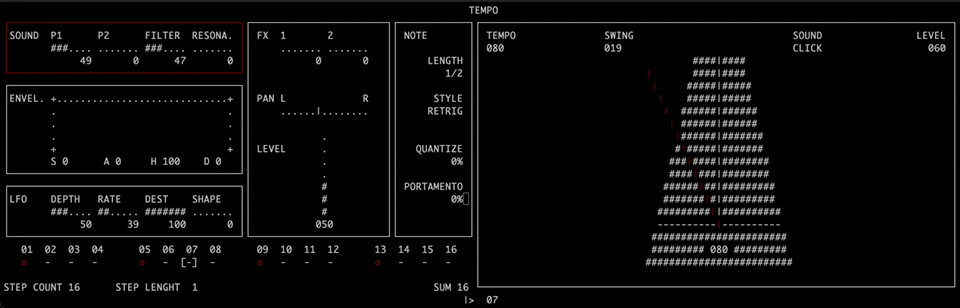

# LibOPZ: a non official API library for the OP-Z
(Tested on firmware version 1.2.39)

First you need to clone and compile the examples. It requires the following dev libraries installed on your system:

- `libz`
- `ncurses` (only for the  c++ examples) 

```
mkdir build
cd build
cmake ..
make
```

After running these commands you can run any of the programs inside the `build/example` folder. 
Highly recomend trying the terminal base companion app. 
**Note** you need to have the OP-Z connected and turned on before running the app 

```
examples/./opz_companion
```



# Roadmap

- [ ] Finish reverse engineering all the telemetry data. For it I'm going through the process of cloning all the functionality of the official companion app into a terminal only version.
- [ ] Finish the terminal clone of the companion app (Linux/MacOS/Windows)
    - [x] Main screen
    - [x] Pages
    - [x] Tempo
    - [ ] Projects (and chains)
    - [ ] Mixer
    - [ ] FX
    - [ ] Tape
    - [ ] Module
    - [ ] Master
    - [ ] Perform
    - [ ] Lights
    - [ ] Motion
    - [ ] Step Components
- [ ] Create a MIDI agnostic version of the `libopz` (an extension of the `src/opz_device.h` abstraction). In case someone want to use something else that RtMidi or manually handle all MIDI events
- [ ] Clean CMake rutines to allow the compilation of `libopz` as a static/dynamic library (with & without RtMidi support)
- [ ] Add the hability to make changes on the OP-Z 
- [ ] Compile a **Python3** module using SWIG (with no RtMidi support, raw midi messages will needs to be handled by a Python library)
- [ ] Compile a **JavaScript** module using WASM (width no RtMidi support, raw midi messages will need to be handled by a JS library)


## Acknowledgment

The effords to reverse engineer the MIDI SYSEX messages from/to the OP-Z are based on:

- [Cengis's](https://github.com/lrk) [z-po project](https://github.com/lrk/z-po-project)
- [Mark Green's](https://github.com/hyphz) [opz docs wiki](https://github.com/hyphz/opzdoc/wiki/)
- [TE's OP-Z guide](https://teenage.engineering/guides/op-z)
